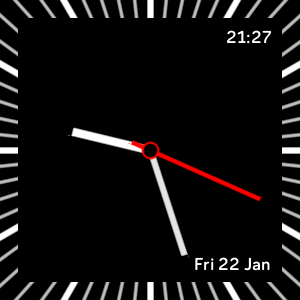

# pomoclock

pomoclock is a simple analogue clock face for Fitbit Versa 2.

Here is how it looks when active:

## Features

- [x] Add date: weekday, day, and month.

- [x] Add digital clock.

- [x] Add Always ON Display support: it hides the second hand. (Not available due to missing AOD permission: not all developers are given this permission by Fitbit).

## Future plans

- [ ] Add pomodoro timer.

- [ ] Add support for other Fitbit smartwatches.

- [ ] Add stats.

- [ ] Add customization settings.

## Getting started

[Guide here.](https://dev.fitbit.com/build/guides/command-line-interface/#the-toolchain-and-shell)

Install Node.js 8.x

npm add --dev @fitbit/sdk
npm add --dev @fitbit/sdk-cli
npx fitbit-build generate-appid
npx fitbit-build

npm install

npx fitbit-build
npx fitbit
fitbit$ install

fitbit$ build
