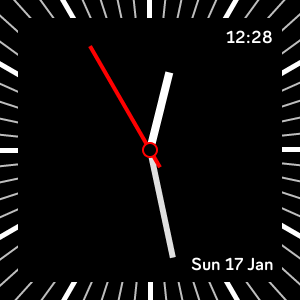
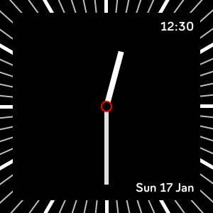

# pomoclock

pomoclock is a simple analogue clock face for Fitbit Versa 2.

Here is how it looks when active:

Here is how it looks with Always ON Display enabled (AOD):

## Features

- [x] Add date: weekday, day, and month.

- [x] Add digital clock.

- [x] Add Always ON Display support: it hides the second hand.

## Future plans

- [ ] Add pomodoro timer.

- [ ] Add support for other Fitbit smartwatches.

- [ ] Add stats.

- [ ] Add customization settings.
