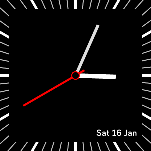

# pomoclock

pomoclock is a simple analogue clock face for Fitbit Versa 2.

Here is how it looks:

## Future plans

- [ ] Add pomodoro timer.

- [x] Add date.

- [ ] Add support for other Fitbit smartwatches.

- [ ] Add stats.

- [ ] Add customization settings.
